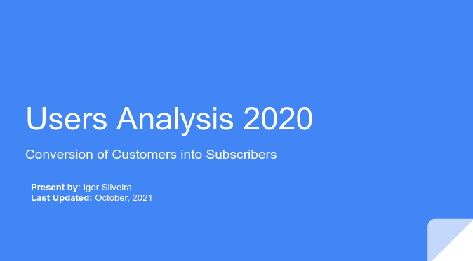

<h1>Bike Share Service Analysis 🚴</h1>

<h2>Introduction</h2>

In this project I will perform data analysis from a bike-share company. The main goal with this project is to deliver answer to key business questions related to how increase annual memberships based on the data currently available.

<h2>Scenario</h2>

The director of Marketing believes the company's future success depends on maximizing the number of annual memberships. Therefore, is necessary to understand how casual riders and annual members use the bikes company differently. From this insights, will be able to design new marketing strategy to convert casual riders into annual members.

<h2>Business Questions</h2>

- How do annual members and casual riders use company bikes differently?
- Why would casual riders buy company annual membership?
- How can the company use social media to influence casual riders to become members?

<h3>Producing Final Report with the following deliverable's:</h3>

1.  A description of all data sources used
2.  Documentation of any cleaning or manipulation of data
3.  A summary of your analysis
4.  Supporting visualizations and keys findings

<h1> Final Report Deliverable's</h1>

<h3>1. A description of all data sources used</h3>

The unique Data Source to this project is from a company called CitiBank, under the [license](https://www.citibikenyc.com/data-sharing-policy) that grants("Bikeshare hereby grants to you a non-exclusive, royalty-free, limited, perpetual license to access, reproduce, analyze, copy, modify, distribute in your product or service and use the Data for any lawful purpose (“License”). After the preliminary analysis I concluded the data is quantitative, structured, first-party and open data.

<h3>2. Documentation of Cleaning and Manipulation of Data</h3>

- I'm choosing Python and Excel for this task. Because at the first moment I will clean and then merge all the csv files into one so I can making the process easier and quicker.
- The csv files contains a few data points that are useless of our analysis suck as (column names): start\_station\_id, end\_station\_id,start\_station\_latitude, start\_station\_longitude, end\_station\_latitude, end\_station\_longitude, bikeid, birthyear. All those columns will be removed to make the data clear and concise.
- The null values was removed. Most of them was related to the location of station names, making impossible to replace since each user select a different start station and end station for their ride. And none of the null values was available in others Datasets from the company.
- Duplicate data, was removed as well.
- Next step is to remove the columns called (Unnamed: 0 and sourcefile name) from the v2 version of the DataFrame.
- I add two more columns, the first is called "ride length" to visualize the length of each ride, so we can have a broad visual of the data. The second column is called "day of week" to check the days related to each ride, this make easier for us to visualize which day of the week the different types of customers use the service.

<h3>3. Summary of Analysis</h3>

*Trip Duration*

- The Average duration of the rides is 1 to 10 minutes.
- Most of the rides takes 4 minutes (25.000 rides)
- Morning peak 07:00  to 12:00. Afternoon peak 16:00 to 19:00 probably because of come back from work.
- The 10th most accessed stations (Use the graph and the tableau map graph for display this info)

*Users Profile*

- Users Genders: The majority of our users base in 2020 was male with 199.807, following female users with 84.798.
- 52.197 users the gender in unknown.
- Most of our users have the range between 26 to 40 years old (Male and Female). 16.000 male users have 32 years old and 5.800 females users at 30 years old.

*Subscribers vs Customers*

- Based on 2020 data we had 68.74% of subscriber users and 31.26% customers. Been 105.284 thousand users that are still able to be converted to subscribers in future Marketing Campaigns.
- Based on the Annual Membership of $15/month we can increase the profit by $1,579.260/year if we convert the 105.284 users into subscribers.
- Those 105.284 customers that are non subscribers have their age between 20 to 46 years old.
- We can see a huge outlier customer value for 1969. This indicate that a value of zero is a missing value (making the gender undeclared)

<h3>4. Supporting visualizations and keys findings</h3>

- Link with the presentation about the data findings and keys points:

https://docs.google.com/presentation/d/18kEU_MBRnlTbolxwvmKo5F4L5Gxk0H8gor9ZJap68Pk/edit?usp=sharing
